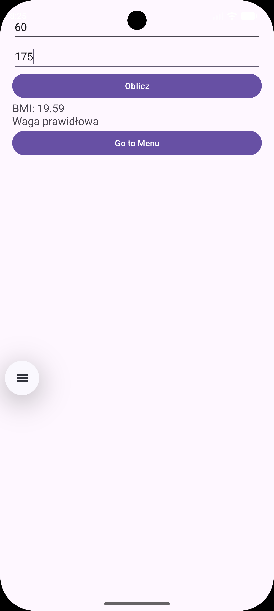
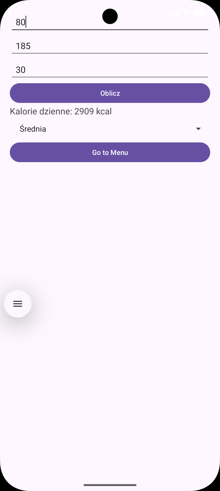
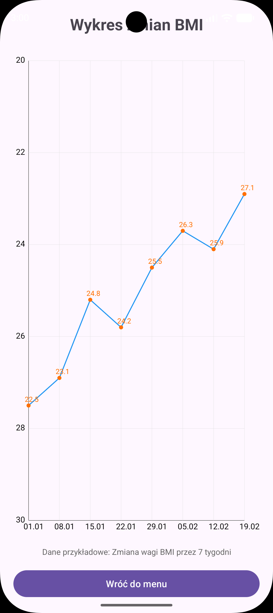
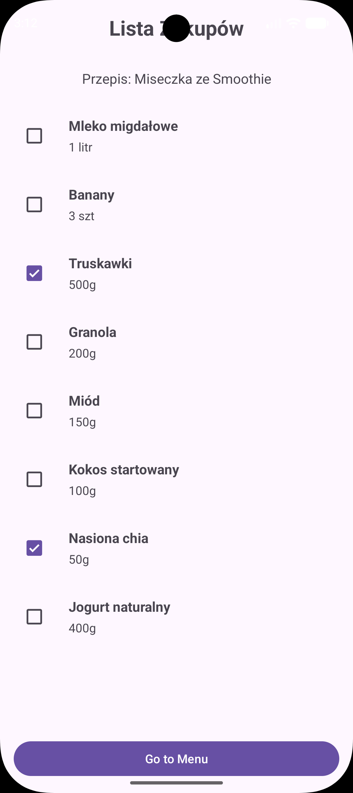
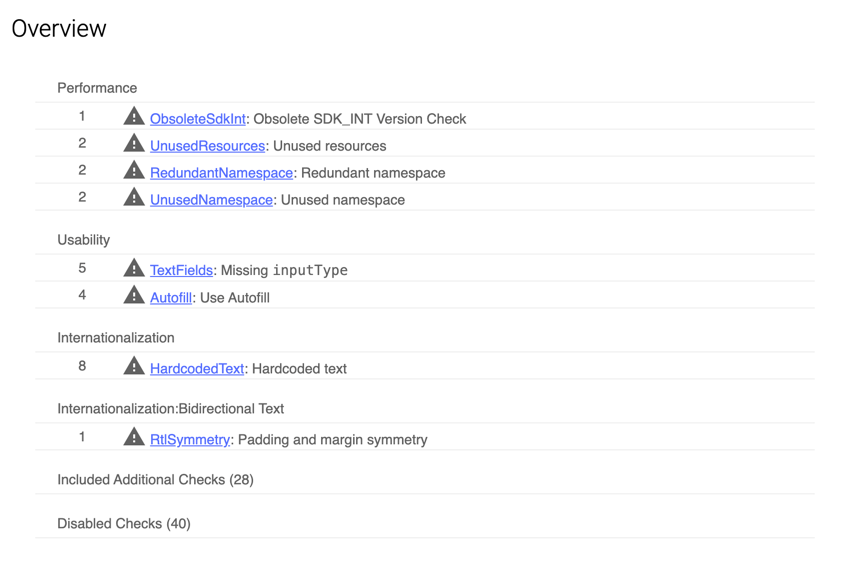
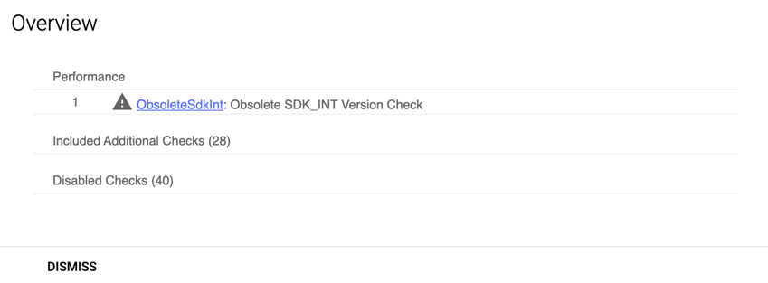
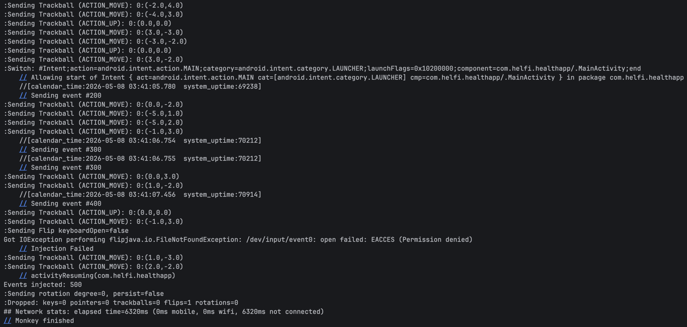

## Zadanie 1

# Ekran Startowy

Ekran Startowy

# Menu

Menu

# BMI

BMI

# Licznik Kalorii

Licznik Kalorii Pusty

Licznik Kalorii

## Zadanie 2

# Wykres BMI

Wykres BMI

# Lista Zakupów

Lista

# Raport Stary

Raport Stary

# Raport Nowy

Raport Nowy

# Monkey

Monkey

